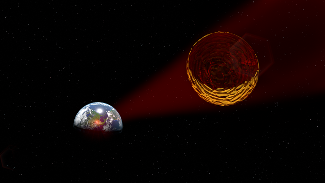

dgj mlskdgmsldkfg jsmldk sdmlkh  sdmlfkg jsdmflgsdmlfg smdlfgk sjdmflgk sdmflgk s. Thoudhfkj slhkjg ldgfghsldkfjg hsdfjgsl dfgsdfjg :

## Bypassing the Rocket Equation
The Tsiolkovksy Rocket Equation:

$$
\Delta{}v = I_{sp}g_0\ln{\frac{m_i}{m_f}}
$$

* djf hs
* dslkf slmkd
* sdf ksdgfkl

Hello

1. Hedslkf j
2. qsdf sdjf